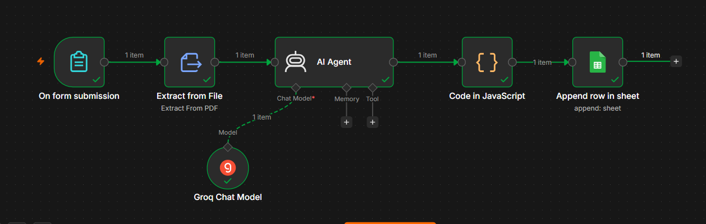
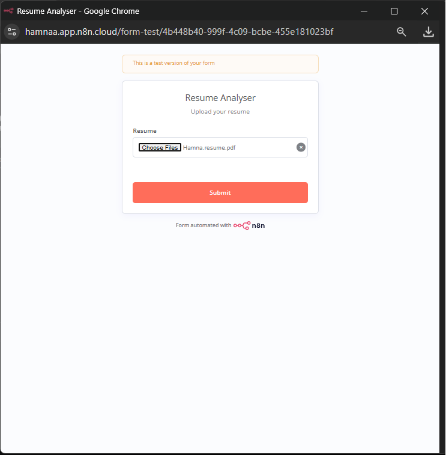

<div align="center">

# 🤖 AI Resume Analyzer using n8n & Groq

### An AI-powered Resume Analyzer that evaluates PDF resumes, calculates an ATS score, identifies strengths and weaknesses, and stores every analysis in Google Sheets.

<p>


</p>

---

### 🚀 Built with n8n • Groq AI • Llama 3.3 • Google Sheets

</div>

---

# 📌 Overview

The **AI Resume Analyzer** is an intelligent workflow built using **n8n** and **Groq's Llama 3.3 model**.

It allows users to upload a resume in PDF format, extracts the text automatically, analyzes the content using AI, calculates an ATS score, identifies technical and soft skills, highlights strengths and weaknesses, suggests improvements, and stores every analysis in Google Sheets.

---

# ✨ Features

- 📄 Upload Resume (PDF)
- 🤖 AI Resume Analysis
- 🎯 ATS Score Calculation
- 💻 Technical Skills Detection
- 🤝 Soft Skills Detection
- ❌ Missing Skills Identification
- ✅ Strengths & Weaknesses Analysis
- 🚀 Resume Improvement Suggestions
- 💼 Best Matching Job Roles
- 📊 Automatic Google Sheets Logging
- ⚡ Powered by Groq Llama 3.3
- 🔄 Built with n8n (No Coding)

---

# 🛠️ Tech Stack

| Technology | Purpose |
|------------|---------|
| n8n | Workflow Automation |
| Groq API | AI Model |
| Llama 3.3 70B | Resume Analysis |
| Google Sheets | Database |
| PDF Extract | Resume Text Extraction |

---

# 🧩 Workflow

```
User Uploads Resume
        │
        ▼
On Form Submission
        │
        ▼
Extract Text From PDF
        │
        ▼
Groq AI Agent
        │
        ▼
Parse JSON
        │
        ▼
Google Sheets
```

---

# 📸 Screenshots

## 🔹 Workflow



---

## 🔹 Resume Upload Form



---

## 🔹 AI Resume Analysis

.png)

---


# 📊 Sample Output

```json
{
  "ats_score": 78,
  "summary": "Highly motivated Bioinformatics student...",
  "technical_skills": [
    "C++",
    "Java",
    "Data Structures"
  ],
  "soft_skills": [
    "Communication",
    "Problem Solving"
  ],
  "recommendations": [
    "Gain internship experience",
    "Develop more AI projects"
  ]
}
```

---

# 📂 Project Structure

```
AI-Resume-Analyzer-n8n/
│
├── README.md
│
├── workflow/
│   └── ai_resume_analyzer.json
│
├── prompts/
│   └── system_prompt.txt
│
├── screenshots/
│   ├── workflow.png
│   ├── form.png
│   ├── output.png
│   ├── google_sheets.png
│   └── upload_resume.png
│
└── sample_resume/
    └── sample_resume.pdf
```

---

# 📈 Google Sheets Example

| ATS | Skills | Job Roles | Date |
|------|---------|-----------|------|
| 78 | C++, Java | Software Engineer | 2026-07-17 |

---

# 🎯 Learning Outcomes

This project demonstrates:

- AI Workflow Automation
- Prompt Engineering
- PDF Processing
- API Integration
- Google Sheets Automation
- JSON Parsing
- n8n AI Agents
- LLM Integration


---

# 👩‍💻 Author

**Hamna Ahmed**

Bioinformatics Student | AI & Automation Enthusiast

- GitHub: https://github.com/hamnaahmed80


---

# ⭐ Support

If you found this project helpful:

⭐ Star this repository

🍴 Fork this repository

💬 Share your feedback

---

<div align="center">

### Thanks for visiting!

Built with ❤️ using n8n & Groq AI

</div>
